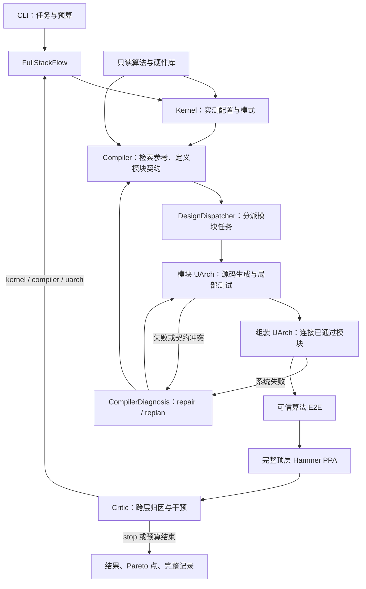

# FAST 当前架构

当前开发主线是 `fast/fullstack/`，入口 `python -m fast.fullstack.cli`。这里的角色分工符合“Compiler 规划和分配、UArch 逐模块实现与组装、测量后 Critic 优化”的流程。

论文流程图：[PDF](../figures/agentflow/fast_agentflow.pdf) · [SVG](../figures/agentflow/fast_agentflow.svg) · [源码与图注](../figures/agentflow/README.md)。

## 调用关系

## 文件职责

| 文件 | 阅读重点 |
|---|---|
| `fast/fullstack/cli.py` | 装配任务、LLM 和硬件工具；不承载优化策略 |
| `contracts.py` | Task、Module、SystemPlan、预算校验和 Pareto 判定 |
| `flow.py` | 总循环、重入、构建验收、PPA/Critic 顺序和结束条件 |
| `agents.py` | 各角色 prompt、上下文、调用记录和 Critic 输出校验 |
| `dispatch.py` | 独立模块任务、依赖屏障、局部重试、Compiler 诊断和最终组装 |
| `library.py` | 参考检索、只读快照、native IP 链接和完整性校验 |
| `behavior.py` | Compiler 声明的有界数学/周期契约，生成局部测试期望值 |
| `tools.py` | Chisel elaboration、RTL 检查、Verilator 和综合/STA |
| `physical.py`、`hammer_driver.py` | Hammer/Yosys/OpenROAD 物理实现、寄生与 PPA |
| `revalidation.py` | 无 LLM 的生成源码复验；支持搬迁后的归档 |
| `artifacts.py` | 流式归档、逐文件 SHA-256 校验、缓存排除清单 |

表中的文件位于 `fast/fullstack/`。命令入口见 [脚本索引](../scripts/README.md)。

## 必须理解的边界

- 算法插件、参考 IP 和 golden 是用户维护的只读库。Agent 在新运行目录生成代码，不修改库。
- Compiler 决定模块边界、端口、数学行为、时序和参考材料。每个模块 UArch 有独立任务和日志；默认 `module_workers=1`，可按依赖并发。最新 DynaX 实验实际串行执行。
- 链接 native IP 使用 `linked_reference_ids`，完整依赖闭包进入编译，哈希受检查；不要求把所有参考子模块重写。
- 局部测试来自 Compiler 的契约，因此不能单独证明算法正确。独立算法插件产生最终 Q/K/V → 数值结果与选择掩码的 golden。
- `CompilerDiagnosis` 处理构建/集成失败；`Critic` 在 E2E 和完整 PPA 之后给优化建议，两者分别计数。
- UArch 重入先保留契约。改变模块延迟可能触发重新规划；最新运行实际完成了这次升级。
- 参考测试不被算成新生成硬件的通过证据；每个候选需要重新运行局部和系统验证。

## 历史 A/B/C 路径

| 路径 | 实际入口 | 能力与证据范围 |
|---|---|---|
| A：联合参数搜索 | `scripts/run_dynax_rediscovery.py` → `fast/agents/rediscovery.py` | DynaX 算法/硬件参数联合搜索；部分 PPA 仍是模型 |
| B：验证失败后的参数修正 | `scripts/refine_rediscovery.py` → `rediscovery_critic.py` | 读取独立硬件失败，修正参数；既有 5-loop 消融属于此路径 |
| C：旧五 Agent 闭环 | `scripts/run_codesign.py` → `fast/orchestrator/flow.py` | 分层重入、候选规划、可验证 RTL 变异 |
| 当前：完整系统生成 | `fast/fullstack/cli.py` → `FullStackFlow` | 按输入算法与只读参考生成新系统，模块/系统验证、Hammer、Critic |

A/B/C 仍有历史实验和共享调用者，保留代码；它们的实验不能自动证明当前主线的能力，反之亦然。旧实现细节见 [历史架构](history/before-cleanup-agent-architecture.md)。
