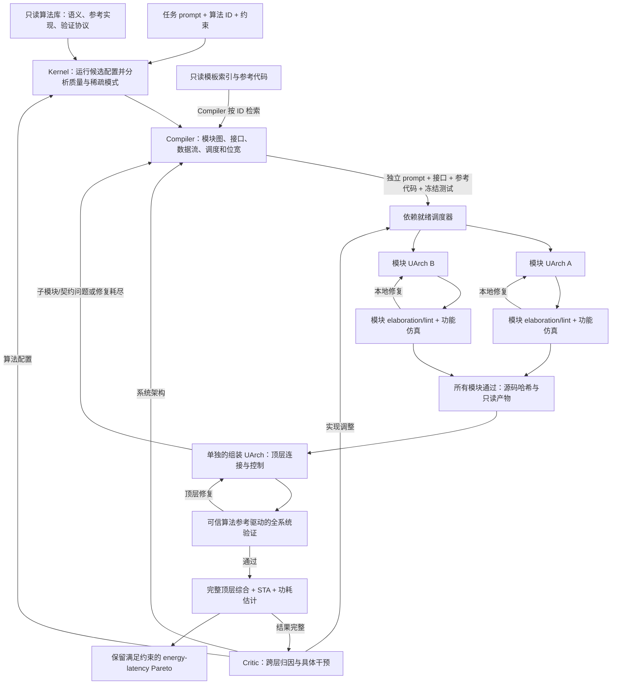

# 新主线：参考库驱动的完整系统生成

这条主线实现用户确认的职责划分，入口是 `python -m fast.fullstack.cli`。
最新结果见 [逐模块设计、独立组装与完整 E2E/PPA](results/fullstack_e2e_20260913/RESULTS.md)：`module_workers=1`，新生成 Chisel 系统通过 100 个独立算法参考用例，重新编译后基础 100 次及额外 5 个种子各 100 次检查全部通过；完整顶层 PPA 已提取，Critic 已调用。

历史串行实现的真实集成结果见 [完整系统生成与 Critic 迭代](results/fullstack_generation_20260913/RESULTS.md)。这些结果不作为本次并行模块/独立组装流程的证据。

此前失败记录见 [并行模块 UArch 实验记录](results/parallel_uarch_20260913/RESULTS.md)：模块并发已实际发生，完整生成因局部测试契约错误失败，尚无新 PPA。

旧的联合参数搜索、验证失败后的参数修复、`FiveAgentFlow` 局部 RTL 变异保留用于复现历史实验；它们的测量不自动成为本流程的证据。

## 先读哪些代码

1. `libraries/catalog.json`：独立算法库与硬件参考库的注册表。
2. `fast/fullstack/contracts.py`：Task、SystemPlan、模块接口和 Pareto 定义。
3. `fast/fullstack/flow.py`：先看 `run()`，再看 `kernel()` 和 `build()`；随后读 `dispatch.py` 的 `run()` 和 `implement()`，理解依赖调度、可配置并发与组装屏障。
4. `fast/fullstack/agents.py`：Kernel、Compiler、UArch、Critic 的职责和结构化输出；Evaluator 是确定性的工具执行器。
5. `fast/fullstack/behavior.py`：把数学表达式和固定流水协议编译为确定性的模块测试；随后读 `fast/fullstack/tools.py`：逐模块结构与功能向量检查、整个系统的数值验证、完整顶层综合与 STA。
6. `libraries/algorithms/threshold_attention.py`：一个可执行的可信算法契约范例。
7. `tests/test_fullstack_generation.py`：流程顺序、失败路径和证据边界的测试。



## 各角色实际做什么

**Kernel** 从任务指定的算法 ID 加载可信插件。它先在声明的配置域中执行有预算的配置测量，记录质量损失、稀疏分布与模式，再让 LLM 选配置。它不会自动将未知算法替换为 DynaX/X:M，也不相信 LLM 自报的精度数字。默认最多预分析 16 个配置；小域遍历，大域按 seed 采样；合法的额外提议也必须实际测量。这个上限是预分析预算，不是所有 Kernel 执行次数的上限，重试次数另受 `module_attempts` 限制。

**Compiler** 先读模板索引，通过 `read_templates` 请求相关参考代码，再生成有向无环模块图，明确每个模块的用途、端口方向/位宽、依赖及实现说明，决定数据通路、缓冲与控制。模块名字、数量和拓扑由计划决定，没有固定 BUILD_ORDER。可信算法规定系统外部契约，Compiler 自主决定内部实现。每个模块的 `reference_ids` 明确列出它应参考的库代码；Compiler 必须先读过这些代码，才能确认分配。UArch 收到的是对应模块的 `reference_code`、`reference_provenance` 和关联的 `reference_tests`，不会自动收到整套硬件库。

**Compiler 的派发任务** 除架构说明之外，每个模块必须有独立 `design_prompt`，非顶层模块现在由 Compiler 声明可执行 `behavior`，确定性执行器生成并冻结 `tests`；保留显式向量模式用于历史兼容。调度器在启动任何 worker 前保存全部 `job.json`，包含模块任务、接口、参考代码及哈希。模块图按真实依赖运行：默认 `module_workers=1` 逐模块执行；提高该值后，没有依赖的模块可同时设计/验证，父模块等待已通过的子模块，得到真实源码后再实现，不使用占位 stub 冒充验收结果。

**模块 UArch** 每个非顶层模块使用独立会话、审计目录、生成文件和 `module_attempts` 小循环。先检查端口/依赖和 Chisel elaboration 或 Verilog lint，再通过 Verilator 执行从行为契约计算的功能向量；失败日志只回到负责该模块的 UArch。同一功能断言连续失败两次时，会提前升级给 Compiler 检查设计和冻结测试的一致性；这不是判定测试一定有错。验收源文件设为只读并记录 SHA-256。任何模块失败都会阻止组装、PPA 和 Critic；已经运行的同批 worker 收尾后再回到 Compiler 重规划。

**组装 UArch** 是另一个独立会话，只有所有非顶层模块通过才运行。它收到完整的验收模块集合，按 Compiler 的顶层任务连接并实现控制，只能输出顶层文件。每次组装后先检查结构，再运行算法插件的独立端到端验证；失败优先在 `assembly_attempts` 小循环中修复顶层，已验收子模块保持不变。若发现子模块或接口契约有问题，返回 `replan_reason` 给 Compiler，重新派发；不会让组装者悄悄改写已通过模块。当前重新规划会重新生成该 build 的模块，尚未实现跨 build 的选择性缓存复用。

模块功能向量是 **Compiler 定义的有限契约测试**，不是独立算法等价证明。它能在局部捕获算术、边界和协议错误，库注册表中的 `test_references` 将已有 golden Python/C++ testbench 与硬件模板一并冻结、检索，并按模块传给 UArch。Compiler 需在 `design_prompt` 中写明可复用的测试、位宽/有符号格式/接口差异与新增边界；原 C++ testbench 不会未经适配就被计为新模块的验证证据。

期望值现在由 `behavior.py` 根据表达式和流水线协议计算，避免手算 packed 值与排空时序。Compiler 仍可能写错数学行为或前置条件，此时应重规划修正契约。最终算法正确性仍由库内可信参考产生的端到端向量独立判断，不能把“所有模块通过”理解为全系统已正确。

**Evaluator** 是可信的确定性工具链执行器。端到端测试向量和 testbench 由算法插件提供，Agent 无权生成或替换该 golden。模块测试只接受 Compiler 的有界整数/周期声明，由确定性工具生成 testbench，不执行 Agent 提供的测试代码。只有全系统验证通过，才对相同 RTL 的完整 top 和全部子模块做综合与 STA。工具失败不会用 L1 数字补齐。

**Critic** 只在全系统功能验证通过且 PPA 字段完整后运行，引用实际结果中的字段路径，给出 Kernel / Compiler / UArch / stop 中一种干预。模块 bring-up 期间不调用它。重入 Kernel 会废弃旧计划和实现；重入 Compiler 会重新编排；重入 UArch 首次保留接口与拓扑，重写新一轮工作区的实现，失败仍可升级给 Compiler。保留的 `system_plan` 中实现文字可能仍是初始版本，因此每个模块另存 `implementation.json`，本轮结果汇总 `implementations`；实际流水、源码和工具周期结果才是最终实现依据。

## 库和生成产物的边界

```text
libraries/
  catalog.json                  用户维护的注册表，运行中只读
  algorithms/*.py               可信算法契约与参考执行器
  hardware/*.v                  可参考的硬件模板
hardware/chisel/...              注册表还可引用这里已有的 Chisel 模板

<run-dir>/                      必须是新目录
  task.json, algorithm_contract.json
  library_manifest.json         原文件和快照的 SHA-256
  references/                   只读副本，不放生成代码
  kernel_survey.json             Kernel 的真实测量记录
  agent_calls/<role>/*.json      Kernel/Compiler/Critic 原始调用
  agent_calls/round_*/build_*/<Module>/<role>/*.json  独立模块/组装会话
  events.json                   完整阶段事件与反馈顺序
  round_01/
    build_01/
      system_plan.json
      compiler_reference_reads.json  Compiler 的检索历史
      reference_bindings.json        各模块分配的参考 ID、描述与哈希
      accepted_modules.json      组装前的模块验收清单与哈希
      <Module>/job.json           派发前准备的完整独立任务
      <Module>/<Module>.scala    Chisel 模式的新模块（Verilog 模式为 .v）
      <Module>/check_*/emitted/*.v  Chisel elaboration 发出的 RTL
      <Module>/attempt_*.*.txt   每次被检查的实现版本
      <Module>/implementation.json  本轮 UArch 实现说明、源码哈希、参考与干预
      <Module>/check_*.json      模块检查结果
      <Module>/check_*/          每次检查的独立完整日志和编译目录
      <Top>/check_*/trusted_vectors.json, trusted_testbench.sv
      <Module>/check_*/functional/  模块功能测试、仿真日志
      verification.json         整个系统的数值与周期结果
      whole_system.v, mapped.v  与 PPA 对应的完整 RTL 和网表
      *.log, *.json             原始工具日志、命令与指标
    result.json
  summary.json                  各轮结果、约束、Critic 干预和 Pareto 轮次
```

生成器只接受硬件源代码文本，文件名由合法模块 ID 决定，不接受 LLM 指定的任意写入路径或 shell 命令。每轮及结束时检查原参考文件和副本的哈希。原库不会被 chmod，也不会由生成器改写；被发现变动时整轮结果失效。

这些是生成流程的隔离与完整性措施，不是针对恶意 Python 插件的操作系统沙箱。算法插件由用户安装和信任；生产级多用户执行需要另加受限 worker。当前 CLI 在一个 Python 进程中使用有界线程池并行调度模块，事件写入加锁；Vertex worker 各用独立 API client。自定义 LLM backend 应提供 `fork()` 返回独立实例，或保证自身 `prompt()` 并发安全。每个硬件工具调用使用独立构建目录，可运行于 Slurm；尚未接入 CHIA 分布式调度。

## 运行

在 FAST 根目录使用具备 Vertex SDK/ADC 的 Python 环境：

```bash
python -m fast.fullstack.cli \
  --task configs/fullstack/threshold_attention_chisel.json \
  --catalog libraries/catalog.json \
  --run-dir /scratch/<user>/fast-generated/run-001 \
  --tool-root /scratch/<user>/micro-hackthon \
  --project <vertex-project> \
  --model gemini-2.5-pro
```

`tool-root` 下需有 `containers/{verilator,yosys,opensta}.sif` 和 `pdk/nangate45/NangateOpenCellLibrary_typical.lib`。PATH 需包含 apptainer；Chisel 还需要 Java 和 `tool-root/tools/scala-cli`。安装项目后也可用 `fast-generate`。

`template_read_budget` 限制每次规划中的库检索轮数，默认 2；每次检索可取多个 ID。未知 ID 会拒绝，未读过的分配会先取回代码让 Compiler 审阅，避免把引用写进计划却没有实际读取。没有适用模板时允许 `reference_ids: []`，由 Compiler 说明从头设计的理由。

任务的 `hdl` 可选 `auto`（Compiler 选择）、`chisel` 或 `verilog`。显式指定后必须遵守，不能默默切换。示例配置分别为 `threshold_attention_chisel.json` 和 `threshold_attention_verilog.json`。同一个系统当前选择一种生成语言，两种语言共用后续 RTL 验证与物理评价。

`max_loops` 为 1..5，每轮另有 `compiler_attempts` 重规划预算、`module_attempts` 每模块修复预算、`assembly_attempts` 组装修复预算（默认 3）。`module_workers` 控制同时活跃的模块 worker 数（默认 1，1..8），应据此为 Slurm 分配 CPU/内存；依赖链会限制实际并行度。最后一轮仍记录 Critic 分析，但 `critique_applied=false` 明确表示没有下一轮执行。失败和退化都保留，最终推荐来自历史可行 Pareto，不直接取最后一次设计。`--critic off` 让相同轮数预算下 Compiler 独立重规划，作为新流程的基础对照；它与历史 B 路径的对照定义不同，后续实验应同时报告调用次数和运行成本。

## 目前支持到哪里

- 已提供的可执行插件是 `threshold_attention`：无符号 4-bit 输入，1 个 query、4 个 key/value，QK 分数按阈值筛选，然后加权求和与整数归一化。它是明确的小型集成工作负载，**不是 softmax attention，也不是 DynaX 的精度替身**。
- 质量指标为合成查询上相对 threshold=0 的归一化平均绝对输出误差；RTL 验证用不同 seed 的 100 条查询，覆盖零值、最大值、阈值边界、重复事务和重置。有限向量通过不等于形式化等价或模型 perplexity 通过。
- 生成后端支持 **Chisel 和 Verilog-2005**。Chisel 使用当前工程已有的 Scala 2.13.12 / Chisel 3.6.1 工具链，UArch 写新的零参数 `RawModule` 类，显式定义端口、时钟和复位；可信驱动负责依赖、main 与 elaboration，生成 RTL 的实际端口必须满足计划。旧 Chisel 工程仅作为参考，生成过程不向它写文件。
- PPA 覆盖完整的这个生成系统，Nangate45 综合单元面积、固定频率下 STA 和全局活动率功耗估计。存储映射为触发器，不省略为未计价黑盒。没有布局布线、SRAM 宏集成或逐网活动标注。
- energy_nj = power_w × latency_ns；latency 来自实测平均仿真周期数和约束频率。它是该活动率假设下的预布局每查询能量估计，不是板级实测能量。

## 添加实际目标算法

在独立算法库添加可信 Python 工厂，并在注册表声明 `source` 与 `factory`。工厂返回的对象必须实现：

| 方法 | 必须返回/保证的内容 |
|---|---|
| `describe()` | 算法语义、有限 `config_space`、数值边界、精确 top `ports`、握手协议 |
| `validate_config(config)` | 拒绝域外配置和语义非法组合 |
| `profile(config, seed)` | 实际执行得到的 `quality_loss`、质量指标定义和稀疏模式 |
| `verification(config, seed, top)` | 独立参考产生的 `testbench`、`vectors`、`expected_cases`、覆盖说明 |

当前 Verilator 协议要求可信 testbench 顶层为 `FASTTestbench`，每条输出 `FAST_CASE cycles=<正整数>`，全部正确后输出 `FAST_PASS cases=<数量>`，任何错误用 `$fatal`。STA 后端约定时钟端口 `clock`，任务固定在指定频率评价；变频搜索需增加显式时钟候选维度和逐候选 STA。

接入完整 DynaX 的下一项关键工作是补齐**输入 Q/K/V 到最终归一化输出**的可信量化语义、测试契约和质量测量适配。现有只检查 scheduler 或选择/完成事件的 testbench 不能充当这个契约。注册未知算法时当前明确失败，不以旧 scheduler 结果代替完整系统结果。

## 不调用 LLM，复验已有设计

```bash
python scripts/revalidate_generated_design.py \
  --run <原运行或归档目录> --round 1 \
  --catalog <冻结源码目录>/libraries/catalog.json \
  --output <新的复验目录> --tool-root <工具根目录>
```

复验先检查生成源码哈希和可信算法源码是否一致，再重新编译/仿真并提取 PPA；Chisel 会重新 elaboration。它用于检查产物可复现性，不算一次新的自主优化运行。原运行的目录和代码不会被修改。


## Compiler 如何调用库并分配参考

第一次看到的是描述和标签索引，例如 `pipelined_divider`（恢复除法、流水级数、valid 传播）。Compiler 请求：

```json
{"read_templates": ["pipelined_divider", "chisel_carry_and_clock"]}
```

框架从只读快照取出源码回传，Compiler 在最终计划中为除法模块填写 `reference_ids: ["pipelined_divider"]`，为算术流水模块填写 `reference_ids: ["chisel_carry_and_clock"]`，同时说明接口适配和连接要求。UArch 得到具体源码后写新类，原参考类不被修改、不会自动作为预写好的新系统直接算作生成结果。

注册表已索引现有 PE、TopK、SRAM、调度等参考，新增模板只需增加一个带 `source`、`description`、`tags` 的条目。描述应说明数值语义、握手和适用范围，避免只用一个文件名让 Compiler 猜用途。

## Compiler 可执行模块契约

`fast/fullstack/behavior.py` 解释受限的整数表达式，不调用 Python eval/exec，不允许任意函数、文件操作或生成的测试代码。Compiler 提供数学行为和输入，执行器计算 expected，UArch 不能改写。下面是一个 3 拍、每拍可接收一笔输入的流水模块：

```json
{
  "behavior": {
    "latency": 3,
    "reset": "reset",
    "valid_input": "in_valid",
    "valid_output": "out_valid",
    "outputs": {"result": "a + 1"},
    "vectors": [{"a": 0}, {"a": 15}, {"a": 7}]
  },
  "tests": []
}
```

`latency=1` 是输入被采样的上升沿之后即可看到输出的一层寄存器；L 拍包含采样这一拍。执行器根据这个定义生成单拍 valid 输入、连续输入、气泡、完整排空及运行后复位测试，复位要求所有输出数据和 valid 清零。data 在无效周期不作断言。组合模块使用 `latency=0`，不声明 clock/reset/valid 元数据。

`let` 可按顺序声明中间量，`outputs` 必须覆盖全部数据输出；支持整数算术、位运算、比较、条件表达式、`lane(word,index,width)`、`pack(width,low_lane,...,high_lane)` 和 min/max。例如点积可写成 `lane(q,0,4)*lane(k,0,4)+lane(q,1,4)*lane(k,1,4)`；混合输入可写 `pack(9,60,70,80,90)`，不用手算大整数。输出按声明位宽截断，除零必须显式处理。

Compiler 提供 3..12 个输入向量，执行器另外加入 12 个固定 seed 的随机合法输入。可选 `input_bounds` 和 `input_condition` 必须描述实际合法输入域，不能为逃避测试任意收窄。无论模块契约如何声明，最终的独立算法 E2E 测试都不随之改变。

当前可执行契约覆盖组合模块和固定延迟、每拍可接收一笔输入的流水模块；复杂控制由顶层组装实现。任意状态机或 backpressure 协议尚需扩展契约；旧的显式逐步测试格式仍可读取与复验。


## Energy Efficiency、共享起点与物理后端

新评估同时记录 `energy_efficiency_queries_per_joule=1e9/energy_nj`，Pareto 的方向是 latency 越低、Energy Efficiency 越高。任务可声明固定 `dense_equivalent_ops_per_query`，附带输出 dense-equivalent TOPS/W；QK+AV 每 MAC 算两个操作，threshold 小任务为 24 ops/query，8-key X:M 行级任务为 48。分子不会随稀疏执行次数改变；这不是实际完成指令的吞吐。

`--initial-run` 允许有/无 Critic 从相同生成源码起点出发。框架校验算法与源码哈希，重新编译、模块验证、独立 E2E 和 PPA；不导入旧测量冒充新证据。`configs/fullstack/critic_matched.json` 设置 3 轮，第一轮为重新验证的共同基线，之后各两次设计机会。轮数预算与实际 LLM 调用数、时间成本分别报告。

Critic 的 `kernel` 干预现在必须提供完整 `proposed_config`，通过可信插件质量检查后才能重入。Kernel 最终选择覆盖原建议，下游以 `context.config` 为准。旧实验中错误建议可能传给 Compiler，因此历史结果不能反向声称已经有这道新检查。

设置 `ppa_backend=hammer_openroad` 可走隔离 Hammer 环境中的 Yosys → OpenROAD 布局、CTS、详细布线、OpenRCX。`physical.py` 装配工具与约束，`hammer_driver.py` 保存兼容性修复和导出钩子。只有真实布线 DEF/网表/数据库、含寄生网络的 SPEF、DRC 报告及完整 PPA 才能完成评估；非零 DRC 或负 setup/hold slack 不可行。不生成 GDS，也不把 Hammer 退出码单独当作成功。

该后端采用 Nangate45 typical 1.1 V、25°C，setup/hold 使用同一公开典型库。它提供物理实现与提取结果；功耗依然依赖单元模型和 activity 设置，不能称为芯片实测或多 PVT signoff。参考 [Hammer OpenROAD 插件](https://docs.hammer-eda.org/en/latest/Examples/openroad-nangate45.html) 和 [OpenRCX 文档](https://openroad.readthedocs.io/en/latest/main/src/rcx/README.html)。

新增 `dynax_xm_row` 是从 DynaX `is_quant=False` X:M 路径导出的有限定点契约：8 keys、二维 Q/K、单维 V、m=4、n1=2/n2=1，芯片内部完成 score、block mass、选择及归一化。LUT softmax 与稳定同分排序是明示的数值细化，不能等同于完整浮点模型或低精度预测器。`audit_dynax_xm_contract.py` 直接调用 DynaX 软件核对，并记录合成输入及真实捕获数据的缩小投影；硬件 E2E 仍需独立通过。

最新验证结果见 [参考测试、Hammer 及 Critic 对照](results/fullstack_extensions_20260913/RESULTS.md)：这里区分参考测试输入、模块行为 gate、独立算法 E2E、布线后网表验证与建模 PPA。阅读实现顺序：`library.py` → `contracts.py`/`behavior.py` → `flow.py` → `dispatch.py` → `tools.py` → `physical.py`/`hammer_driver.py`。
