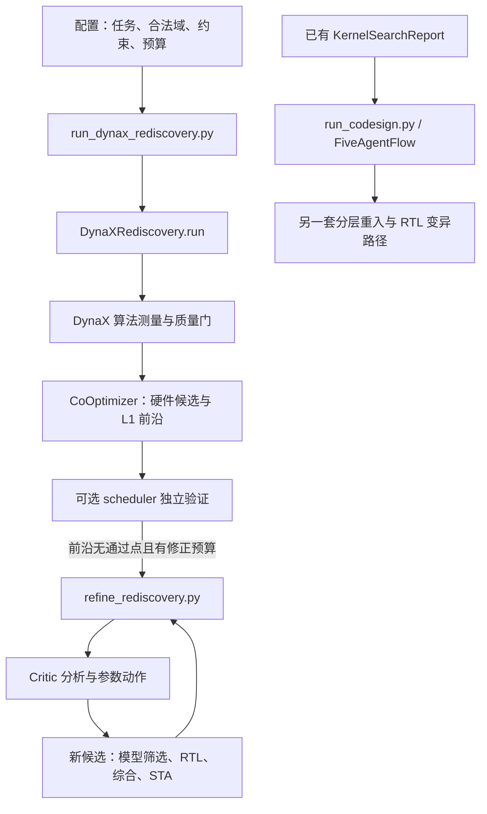

# FAST 快速阅读路线（2026-09-13 核对）

> 最新完整系统生成结果：[参考测试、Hammer 物理实现与 Critic 对照](results/fullstack_extensions_20260913/RESULTS.md)；[20 分钟阅读与新 PPT 思路](results/fullstack_extensions_20260913/READING.md)。下文为较早参数搜索/反馈修正路径的历史记录，数字与结论不能代替本轮生成实验。

> 新增主线请先读 [参考库驱动的完整系统生成](fullstack-generation.md)。下文保留历史调用链和实验口径，不能将它们自动视为新系统生成流程的证据。

先读透一次实际运行，再追它经过的代码。约 45 分钟可以建立主线；不需要先读完整个仓库。PPT 逐页讲法见 [汇报提纲](presentation-outline-20260913.md)。

## 一句话理解项目

FAST 将动态稀疏 attention 的算法参数、调度/硬件配置、测量证据和下一轮决策连起来。Agent 负责提出或修改候选；工具和验收门判断候选是否成立；实验记录负责让结论可追溯。这里的 Agent 是职责，不意味着每个角色都必须是一个 LLM。

长期目标：在质量损失、面积、频率等约束下优化同一任务的 latency–energy Pareto。固定任务下，最小化 J/task 等价于最大化 tasks/J。

当前最扎实的近期结果：**固定通过质量确认的算法，完成 scheduler 独立反馈修复和 24×5-loop Critic 消融。** 它不是一次重新搜索算法的消融，也不是完整 attention 芯片的实测 PPA。

## 0–8 分钟：先知道项目到底证明了什么

打开 [Critic 消融报告](results/critic_ablation_20260911/RESULTS.md)，先看第 2、3、4、6 节。

| 问题 | 已有答案 | 阅读时的边界 |
|---|---|---|
| 算法与硬件参数能否联合搜索？ | `DynaXRediscovery` 有实际参数搜索与质量测量路径 | 这不等于所有硬件参数都被端到端独立验证 |
| Critic 是否真改变下一轮？ | 有结构化动作、执行结果、独立反馈，且做了 off/shadow 对照 | batch=1 时 Critic 可能直接占满 proposer 的槽位 |
| Critic 是否更好？ | 随机 proposer 主实验中，规则与 LLM Critic 的最优 scheduler 延迟均值都低 32.95% | LLM 没胜过规则；换 LLM proposer 后，最终最优延迟相同；n=3 |
| 是否测到面积与功耗？ | scheduler 有综合面积、STA 和统一活动率功耗估计 | 不是布局布线后 PPA、完整 attention 或整机功耗 |
| 能否替代人工专用优化？ | 目前能展示可验证反馈与搜索收益 | 尚不能回答普遍替代，尤其缺外推任务与强人工基线 |

本轮固定标签 `xm:16:8:32:0.75:0.05`，对应 N1/N2/M/T0/T1；32-window 质量损失 3.529661% ≤ 5%。已验证的主实验最优 scheduler 是 32 rows × 8 PE、queue=0，在 350 MHz 下 251 cycles、0.717143 µs。

旧 `STATUS.md` 和历史代码注释有各自时间背景。引用数字以对应实验报告、原始 validation 和源码为准；不要把旧 222 cycles 或旧功耗混入当前算法结果。

## 8–18 分钟：用一条轨迹认识全部关键对象

打开 [main32_llm_s0/refinement.json](results/critic_ablation_20260911/raw/runs/main32_llm_s0/refinement.json)。只看以下字段：

| 字段 | 要回答的问题 |
|---|---|
| `algorithm`、`quality_loss`、`parent_point` | 输入算法、质量门和硬件起点是什么？ |
| `critic_reviews[i].context` | Critic 实际看到了哪些域、约束、历史和独立观测？ |
| `critique.mutations`、`fallback_reason` | 它提出了什么可执行动作，是 LLM 还是规则回退？ |
| `candidates[i].point`、`critic_review_id` | 动作是否真的改变了送去评估的配置？ |
| `analytical_violations`、`stages` | 模型先筛掉了什么，真实工具运行了什么？ |
| `module_verified`、`independent_results` | 功能和目标频率是否通过？面积/周期来自哪里？ |
| `best_verified_design_id` | 后续探索失败时，最终保留的已验证方案是什么？ |

前三个状态足以串起闭环：

| 状态 | queue | scheduler STA Fmax MHz | 350 MHz 门 |
|---|---:|---:|---|
| 初始输入 | 4 | 324.071 | 失败 |
| 第 1 轮 Critic 修改 | 2 | 341.618 | 失败 |
| 第 2 轮 Critic 修改 | 0 | 396.929 | 通过 |

queue=0 是严格 tile 锁步，每行仍有 queue+1=1 个工作条目缓冲。更深队列允许行间提前执行，但也增加缓冲和控制代价。本例减少队列恢复了时序，**不代表总周期比不满足时序的起点更少**。

继续扫后 3 轮：第 3、5 轮没有改善 scheduler 最优值，第 4 轮被 L1 拒绝。这样就能分清“提议”“执行”“通过”和“改进”四件事。

从某个候选目录打开 `rtl/validation.json`，看设计 SHA、完整 trace 覆盖、`sources_unchanged`、`passed`、`frequency_feasible`、`slack_ns`。`design.json` 是验证前冻结输入，其初始 `module_verified=false` 不是最终结论。

不必重新调用 LLM 或启动 Slurm。下面只是只读查看已有结果，在 `FAST/` 执行：

```bash
python - <<'PY'
import json
from pathlib import Path
p = Path('docs/results/critic_ablation_20260911/raw/runs/main32_llm_s0/refinement.json')
r = json.loads(p.read_text())
print('algorithm:', r['algorithm'], 'quality_loss:', r['quality_loss'])
for c in r['candidates']:
    print('loop', c['iteration'] + 1,
          'queue', c['point']['queue_depth'],
          'verified', c['module_verified'],
          'latency_s', c.get('scheduler_latency_s'),
          'L1_rejections', c['analytical_violations'])
print('best:', r['best_verified_design_id'])
PY
```

## 18–38 分钟：沿实际调用链读代码

### 先分清三条路径



A：联合参数搜索；B：验证失败后的参数修正，最近消融用的就是它；C：`FiveAgentFlow` 支持另一套报告/分层重入及 RTL 变异。不要把 C 的能力自动算作 A/B 的本轮实验证据。

| 顺序 | 文件与函数 | 重点看什么；读完应能回答什么 |
|---|---|---|
| 1 | [实验配置](../configs/experiments/dynax_rediscovery.json) | `task/kernel_space/hardware_space/constraints/budgets`：谁定义合法域和预算？类的默认域可能被这里覆盖 |
| 2 | [contract.py](../fast/schemas/contract.py) 的 `parse_algorithm`；[models.py](../fast/schemas/models.py) 的 `KernelMeasurement`、`Critique`、`Mutation` | 算法身份和结构化动作怎样表达？不要先通读整份大 schema |
| 3 | [rediscovery.py](../fast/agents/rediscovery.py) 的 `DynaXRediscovery.run` | 算法批次→质量门→硬件搜索→反馈，怎样消耗预算？ |
| 4 | [dynax.py](../fast/adapters/dynax.py) 的 `measure` | FAST 如何调用相邻 DynaX、读取 perplexity 与稀疏分布？参数变化为何必须重新测质量？ |
| 5 | [cooptimizer.py](../fast/agents/cooptimizer.py) 的 `CoOptimizer.run`；[codesign.py](../fast/agents/codesign.py) 的 `CoDesignPoint/Space`、`violations`、`estimate`、`ObjectiveSpec` | 谁提议、谁筛选？哪些是模型预测？目前默认 Pareto 轴为 seconds/energy_j，但 energy_j 仍是部分模型 |
| 6 | [refine_rediscovery.py](../scripts/refine_rediscovery.py) 的 `main` | 最新独立失败如何进入下一轮？候选、验证和 incumbent 何时保存？ |
| 7 | [rediscovery_critic.py](../fast/agents/rediscovery_critic.py) 的 `search_context/validate_review/CriticGuidedProposer.propose/observe`；[llm_critic.py](../fast/agents/llm_critic.py) 的 `review_search` | 什么信息进入 prompt？动作怎样校验、执行、回退？为什么 batch=1 会跳过 delegate proposer？ |
| 8 | [validate_pareto_scheduler.py](../scripts/validate_pareto_scheduler.py)、[rtl_gate.py](../fast/agents/rtl_gate.py) | 功能、综合、STA 三个门如何连接？什么条件允许认定 module_verified？ |

第一遍暂时跳过：`templates.py` 的全部标定表、`chia` 内部实现、云部署脚本、历史 `docs/results` 的每一份副本。它们可按调用点回查。

## 38–45 分钟：只追本轮真正验证的 RTL

读 [block_scheduler.scala](../hardware/chisel/src/main/scala/predict_unit/block_scheduler.scala) 的四处：

1. 构造参数：rows、PE、queueDepth、blockM；`entries=queueDepth+1`。
2. 每行 `Queue[Pass]`：存的是保留列索引、active 和 last，不是完整 K/V 数据缓存。
3. `ahead` / `withinBarrier`：允许领先多少个 tile；queue=0 的锁步如何形成。
4. `barrierAdvance`、性能计数器和 `drained`：什么时候推进、什么时候完成、周期如何计数。

再看 [tb_block_scheduler.cpp](../hardware/tb/tb_block_scheduler.cpp) 和 [gen_workload_stimulus.py](../hardware/golden/gen_workload_stimulus.py)：真实稀疏 trace 怎样变成激励，哪些守恒条件被检查。

理解其他硬件时，再读 [硬件分层说明](agent-architecture.md)：`AttentionTile → AttentionTileTop → AttentionTileSystem` 是不同集成/验证范围。当前 system 仍有单行、外部分数/block mass、完整数值对齐等限制，不能把“System”名字当成已完成全系统验证。

## 读完应该能回答的六个问题

- 一个设计点包含哪些算法和硬件参数，合法域来自哪个运行配置？
- 质量不合格、L1 不可行、RTL 功能失败、时序失败各在哪一层被拒绝？
- Critic 的哪条 JSON 动作真正改变了哪个候选？
- 修改 bank/divider 是否改变当前 scheduler 网表；若没有，如何证明这些修改有收益？
- 0.717 µs 和 2.80 mW 分别覆盖什么任务/模块与假设？
- 为什么已有结果支持反馈闭环，但不支持“LLM 已替代人工专用优化”？

如果这六个问题能清楚回答，就足以进入项目汇报与后续改进讨论。
