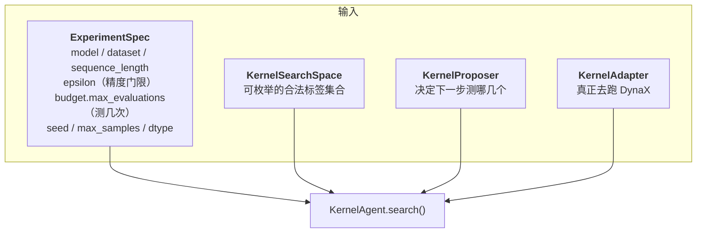
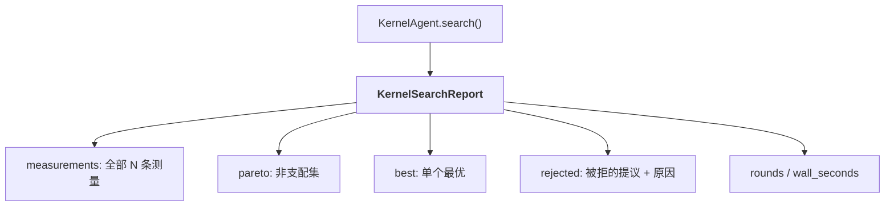
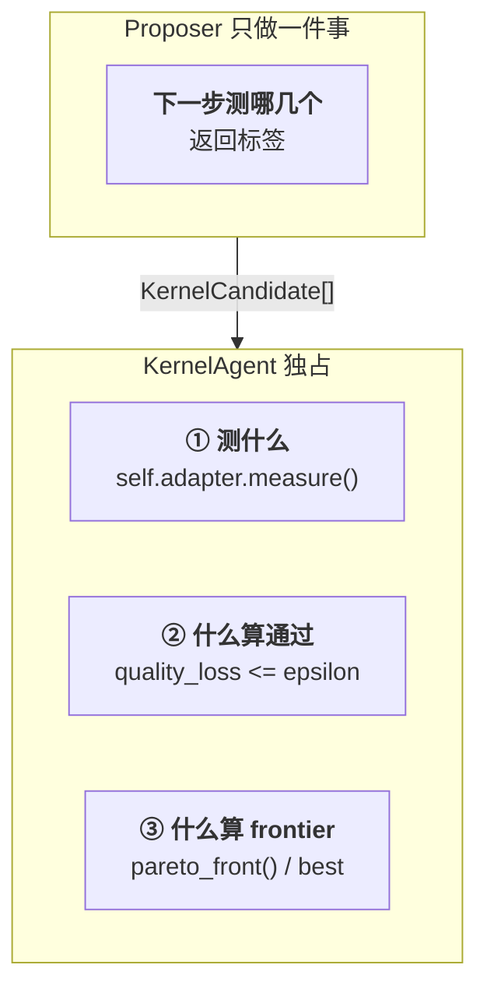
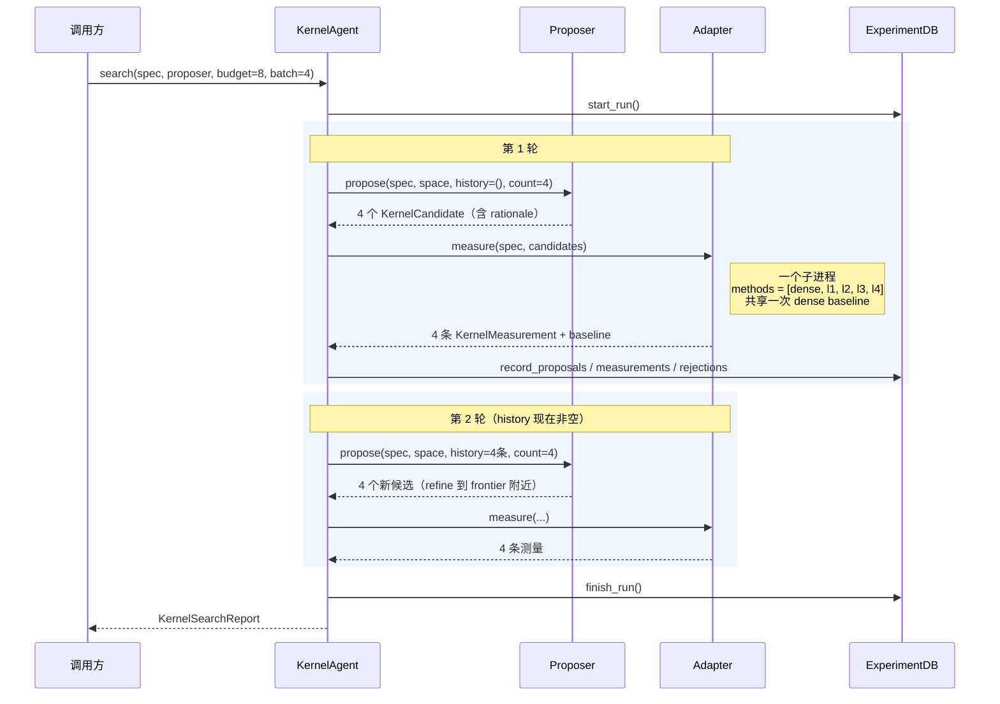
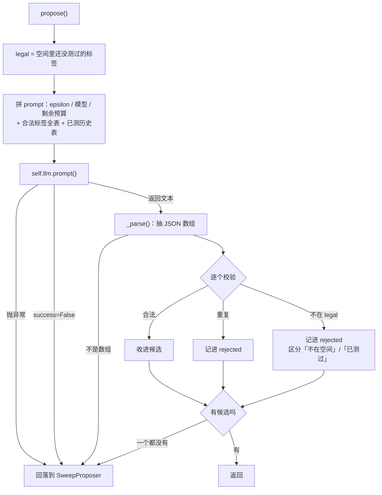

# Kernel Agent 设计说明

> 对应代码：[`fast/agents/kernel.py`](../fast/agents/kernel.py)、
> [`fast/agents/proposers.py`](../fast/agents/proposers.py)、
> [`fast/adapters/dynax.py`](../fast/adapters/dynax.py)
>
> 这份文档描述的是**现状**。已知的设计缺口集中在最后一节，没有混进正文。

---

## 1. 一句话职责

**Kernel Agent 花掉一笔测量预算，而不是做一次测量。**

这是它和「跑一次 DynaX」的根本区别。它拿到 N 次测量的预算，要在一个可枚举的
稀疏配置空间里，用这 N 次找出「在精度门限内尽可能稀疏」的那些配置。

---

## 2. 它在流水线里的位置


Kernel Agent 是**链条的第一环**，它的输出是后面所有层的输入。特别是
`KernelProfile`（稀疏的**分布**而不是均值）——Compiler 用它定 tile 大小和
并行度，µArch 用它算 PE 利用率。

---

## 3. 输入



### 3.1 `ExperimentSpec` — 实验的定义

| 字段 | 含义 |
|---|---|
| `model` / `dataset` / `sequence_length` | 在什么上测 |
| `epsilon` | **精度门限**：相对困惑度上升的上限 |
| `budget.max_evaluations` | **测量预算**：总共允许测几个配置 |
| `seed` / `max_samples` / `dtype` | 可复现性 |
| `sparse_method` | **输入的算法**（`xm` / `nm` / `topk`）。搜索空间由它限定 |
| `sparsity_x` / `sparsity_m` | 单次评估（`run()`）用的配置 |

### 3.2 `KernelSearchSpace` — **一个给定算法**的配置空间

> ⚠ **算法是输入，不是搜索维度。**
>
> 这一点曾经搞反过：`labels()` 把 xm / nm / topk / sanger / salo 全部枚举在
> 一起，于是 Kernel Agent 在**选算法**。那不是这个系统要做的事——算法由使用者
> 给定（DynaX 的是动态 X:M），要探索的是**它的配置**，以及为这个配置协同设计
> 的架构。
>
> 连锁后果不止一处：`select_candidates` 有一条「先保方法族覆盖」的规则，它的
> 全部目的就是让候选散布到不同算法上；Critic 在算法层的变异因此变成
> 「换成 sanger」，而不是「换一组 X:M 参数」。

```python
algorithm = "xm"                     # 输入。由 --algorithm 给
block_m   = 64
xm_high   = (8, 16, 32, 64)          # X:M 里 mass 大的块保留几个
xm_low    = (4, 8, 16, 32)           # mass 小的块保留几个（约束 low <= high）
nm_kept   = (4, 8, 16, 32)           # algorithm="nm" 时才用
topk      = (32, 64, 128, 256)       # algorithm="topk" 时才用
```

`labels()` 只展开**这个算法**的配置：

```
algorithm="xm"    ->  xm:8:4:64  xm:8:8:64  xm:16:4:64 ... （13 个）
algorithm="nm"    ->  nm:4:64  nm:8:64  nm:16:64  nm:32:64
algorithm="topk"  ->  topk:32  topk:64  topk:128  topk:256
```

**哪些算法能被搜，以及为什么另两个不能。** `xm` / `nm` / `topk` 的配置在
**标签语法里**（DynaX 的 runner 解析 `xm:N1:N2:M`、`nm:N:M`、`topk:K`），
所以可枚举。`sanger` 和 `salo` 不行，原因是结构性的而不是我们没写：

| 算法 | 配置在哪 | 可搜索 |
|---|---|---|
| `xm`（DynaX 自己的） | 标签 `xm:N1:N2:M` | ✅ 13 个配置 |
| `nm` | 标签 `nm:N:M` | ✅ 4 个 |
| `topk` | 标签 `topk:K` | ✅ 4 个 |
| `sanger` | runner 的**全局参数** `--threshold-sanger`，一次运行一个值 | ❌ 基线 |
| `salo` | 五个参数（match_size / pe_size / global_nums / random_nums / dilation）硬编码在 `gen_sparsity_mask_salo` 函数体里 | ❌ 基线 |

它们放在 `baselines()` 而不是 `labels()`——**不混**。要用它们对照，就整体跑一次，
那是一次对照实验不是一次搜索。给 `algorithm="sanger"` 会**明确报错**而不是
悄悄给一个单点空间。

> **为什么必须可枚举**：proposer（尤其是 LLM）返回的是**标签字符串**。
> 不在集合里的标签在**测量之前**就被拒掉并记进 `rejected`。
> 所以一次幻觉的代价是零，而且是**可见的**——它出现在报告里，不是悄悄消失。
> 算法限定之后这一条更强了：提议另一个算法也会被同一个门拒掉。

---

## 4. 输出



每个候选产出一条 `KernelMeasurement`：

| 字段 | 含义 | 谁消费 |
|---|---|---|
| `quality_loss` | 相对困惑度上升 | ε 门 |
| `actual_sparsity` | **实测**稀疏率（不是标称的）| frontier |
| `block_occupancy` | 还有保留值的 64 宽列块比例 | Compiler |
| `index_entropy` | 保留列散得多均匀 | Compiler |
| `profile: KernelProfile` | **分布**：行密度直方图、块密度直方图、负载不均衡度、列质量集中度 | Compiler + µArch |
| `proposed_by` / `rationale` | 谁提议的、理由 | 事后审计 |
| `status` / `error` | 失败也是一条记录 | 别把失败当没发生 |

> **`profile` 是重点。** 上面几个标量是均值，而 tile 大小和 PE 负载均衡是由
> 稀疏的**形状**决定的——均值恰好掩盖了让脉动阵列空转的那部分。

---

## 5. 核心设计：三个决策的归属

**这是理解这个 Agent 的关键。** Agent 自己持有三样东西，proposer 一样都碰不到：



### 为什么这样切

因为要做的是一个**对照实验**：规则版 proposer 和 LLM proposer 谁更会花预算。

如果 LLM 能碰测量方式或 ε 门，两组就不是在同样的条件下比了——它可能靠放宽
门限来「赢」。把这三样锁在 Agent 里，两种 proposer 就**只在「会不会选」这一个
维度上**有差别，比较才成立。

代码里的原话（[kernel.py:26](../fast/agents/kernel.py)）：

> The agent owns three things a proposer must not touch: what gets measured
> (the adapter), whether a result clears the accuracy budget (the epsilon gate),
> and what counts as a frontier.

### 决策的当前实现

**先说一件不在这三个里的事：算法。** 算法是**输入**（`--algorithm`），
Agent 和 proposer 都不选它——搜索空间由它限定，所以「提议另一个算法」
和「提议一个不存在的配置」被同一个门挡掉（见 3.2）。

```python
# ② ε 门
accepted = [i for i in history if i.within and i.quality_loss <= spec.epsilon]

# ③ 单个最优 —— 在通过的里面取最稀疏的
best = max(accepted, key=lambda item: item.actual_sparsity)

# ③ frontier —— (稀疏度, 精度损失) 二维非支配集
def pareto_front(history):
    """Block occupancy is reported but deliberately not part of the frontier:
    it is the compiler and micro-architecture layers that turn low occupancy
    into speed, so the kernel layer must not pre-judge it."""

# ④ 交给下游的 K 个候选 —— 同一个算法的不同配置，
#    在 (稀疏度, tile 不均衡度) 上散开
picked, shortfall = select_candidates(accepted, count)
```

> **④ 是第四个决策，也归 Agent。** 它挑的是 Critic 在算法层的动作空间。
> 散布轴是**下游真正感受到的**两个量：稀疏度决定 cycles，tile 内不均衡度
> 决定 PE 利用率。精度损失不作为轴——进到这一步的点已经全部通过 ε 门。
>
> 这里曾经的第一阶段叫「先保方法族覆盖」，按标签前缀分组、每族先进一个。
> 那条规则回答的是「该选哪个算法」——**而算法不归这里选**。族固定之后它
> 要么没事可做，要么在做错事。

> **注意 `pareto_front` 的注释**：`block_occupancy` 被**刻意**排除在 frontier
> 之外，理由是「把低占用率变成速度是 Compiler 和 µArch 的事，Kernel 层不该
> 预判」。这个理由在写它的时候是对的。第 9 节会说为什么现在不再对。

---

## 6. 搜索循环



### 为什么按轮批量，而不是一次一个

```
加载模型：       几十秒   ←── 贵的是这个
多测一个配置：   约十秒
```

所以一轮 = **一个子进程，命令行上带着这一轮全部标签**，共享同一次 dense
baseline。`batch=4` 是在「摊薄加载成本」和「早点看到结果好调整」之间取的点。

### 循环的终止条件

```python
while len(history) < budget:
    want = min(batch, budget - len(history))
    candidates = proposer.propose(spec, space, history, want)
    if not candidates:      # 空间测完了，proposer 提不出新的
        break
```

预算耗尽，或者 proposer 提不出东西（空间被测完）。`Budget` 在构造时就拒绝
非正的 `max_evaluations`，所以这里不再重复检查——**一个不变量只由一个地方负责**。

### `db` 为什么是注入的而不是自有的

```python
def search(self, spec, *, proposer=None, space=None, batch=4, db=None):
```

`db` 作为参数传入而不是 Agent 持有，有两个理由：测试里 Agent 保持是输入的
纯函数；以及**记录一次搜索永远不会改变那次搜索的行为**。

---

## 7. 两个 Proposer

两者实现同一个 `KernelProposer` 协议：

```python
def propose(spec, space, history, count) -> tuple[KernelCandidate, ...]
```

### 7.1 SweepProposer — 确定性对照组

```
第 1 轮   _spread()   在标签列表上等距取样
          │           ←── 为什么：frontier 不能从一个角落猜出来
          ▼
第 2+ 轮  _refine()   在两点之间二分
          │
          ├── edge = ε 内最稀疏的那个
          ├── over = ε 外最不稀疏的那个
          └── target = (edge + over) / 2      ←── frontier 转折就在这里
```

如果还没有任何配置越过 ε，就往更稀疏的方向推（`edge + 0.05`），直到精度门限
真的开始起作用。

### 7.2 LLMProposer — 同一个门下让模型花预算



> **四条回落路径**：LLM 调用异常、返回 failure、回复不是 JSON 数组、
> 提议全部非法。**proposer 挂掉不能让整个搜索结束**——它只负责建议，
> 而建议是可以退回确定性版本的。

---

## 8. LLM 的 Prompt

### 8.1 原文

```
You are the Kernel Agent in a hardware/software co-design loop for dynamic
sparse attention. You choose which attention configurations to measure next.

Goal: find configurations that prune as much of the attention matrix as
possible while keeping the relative perplexity increase at or below
epsilon={epsilon}.

Two measured quantities matter to the hardware, not just sparsity:
- block_occupancy: the fraction of 64-wide column blocks that still hold a kept
  value. Lower is better: an accelerator can skip a whole empty block. Two
  methods at the same sparsity can differ completely here.
- index_entropy: how evenly the kept columns are spread. Near 1.0 means spread out.

Model: {model}
Dataset: {dataset}, sequence length {sequence_length}
Measurement budget left: {remaining} configurations, choose {count} now.

Legal labels (you MUST choose only from these, exactly as written):
{labels}

Already measured:
{history}

Reply with ONLY a JSON array, no prose, no code fence. Each element:
  {"label": "<one legal label>",
   "rationale": ["<cites a specific measured number or states this is unexplored>"],
   "expected_effect": "<what you expect to change and why>"}

Rules: propose exactly {count} distinct labels that are NOT already measured.
Each rationale must reference a measured value from the table above, or say
plainly that the region is unmeasured. Do not invent labels.
```

`{history}` 展开成一张表，**只有四列**：

```
  label                 quality_loss  sparsity  block_occupancy  index_entropy
  xm:16:8:64                 +0.0182    0.8412           0.4231         0.9310
  nm:16:64                   +0.0074    0.7503           0.6180         0.9942
  topk:64                    +0.0311    0.7891           0.5023         0.8817
```

失败的配置也进表，不是被过滤掉：

```
  salo                  FAILED (DynaX produced no results.json (exit code 1))
```

### 8.2 每一段的设计意图

| prompt 片段 | 为什么在那里 |
|---|---|
| `Legal labels (you MUST choose only from these)` | 配合空间可枚举——把校验规则**也**告诉模型，减少无谓的往返 |
| 两个硬件量的解释 | 让模型知道稀疏度不是唯一目标。**但这是定性的**，见第 9 节 |
| `Measurement budget left: {remaining}` | 预算是有限资源，模型该知道自己还剩几次 |
| `rationale` 必须引用表里的数 | **可审计**。事后能看出它是在推理还是在猜 |
| `或者明说这块没测过` | 给「探索」一个合法的理由，否则模型会编一个引用 |
| `expected_effect` | 让预期落在纸面上，事后可以和实测对照 |
| `ONLY a JSON array, no prose, no code fence` | 解析器仍然容忍 fence 和前言（`_extract_json_array`）——**要求严格，解析宽容** |

---

## 9. 边界：它刻意不做的事

| 不做 | 为什么 |
|---|---|
| 不生成新的稀疏算法 | 空间可枚举是幻觉零成本的前提 |
| 不决定 tile 大小 / 并行度 | 那是 Compiler Agent 的输出 |
| 不评估硬件 | 那是 µArch + Evaluator |
| proposer 不碰 ε 门 | 否则规则版和 LLM 版的对照就不成立 |
| 失败不重试 | 失败是一条记录（`status` + `error`），不是一次没发生的事 |

---

## 10. 已知缺口

这一节是**待办**，不是现状描述。

### 10.1 目标函数已经过时

现在的判据是「ε 内最稀疏」，`pareto_front` 的注释说 Kernel 层不该预判硬件。
**那个理由在没有实测硬件后果时是对的。现在有了。**

同一份工作负载（TinyLlama L10）、DynaX-S、queue_depth=2、8 banks 下实测的
硬件代价倍数 `(1/PE利用率) × 访存减速`：

| 方法 | PE 利用率 | 访存减速 | **硬件代价** |
|---|---|---|---|
| `nm:16:64` | 1.000 | 1.19× | **1.19** |
| `sanger` | 0.765 | 1.28× | 1.67 |
| `topk:64` | 0.937 | 1.79× | 1.91 |
| `xm` | 0.832 | 2.14× | **2.58** |

跨度 **2.17×**，而 `_refine()` 在稀疏度上二分的步长通常是几个百分点。
**没被优化的那个轴比正在优化的那个轴大一个量级。**

来源：[`hardware/README.md`](../hardware/README.md) 的 BlockScheduler 与
KeyFeeder 两节，均为 Verilator 实测 + 真实模型工作负载。

### 10.2 prompt 里的硬件信息是定性的

模型被告知 `block_occupancy` 「越低越好」，但**没有换算率**——它答不出
「低 0.1 的占用率值得多 0.02 的精度损失吗」。而这个换算率现在实测可得。

prompt 里也完全没有 bank 冲突和负载不均衡，因为写它的时候这两个量还不存在。

### 10.3 ~~`sparse_method` 没有被填~~ — 已修

`KernelResult.sparse_method` 默认 `"xm"`，而没有任何 adapter 去填它，
下游的 `gather_slowdown()` 于是对每个 kernel 都查 xm 那一行——恰好是实测里
最差的一档。

三个构造点都已补上：`dynax.py` 的成功与失败路径用 `method_label(spec)`，
`flow.py` 的 `_as_kernel_result` 用获胜测量的 `label`（这是搜索结果流向下游的
唯一通路），`deterministic.py` 用 `spec.sparse_method`。回归测试见
[`tests/test_agent_defaults.py`](../tests/test_agent_defaults.py)。

### 10.4 历史统计文件里没有 tile 内不均衡度

`mean_tile_load_imbalance` 是后加进 `sparsity_stats.py` 的。老的统计文件里
没有这个键，`KernelProfile.tile_imbalance_for()` 会退回全局 `load_imbalance`
——那个量偏悲观 2-3 倍，而且**方法之间的排序可能是反的**。需要重跑 eval matrix。
