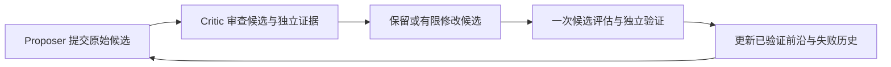

# 下一版 Critic 的改进设计

以下是消融过程中识别的结构问题与下一轮建议；它们没有偷偷回写到本轮冻结代码、改变已经提交的实验策略。

## 1. 让 Critic 审查一个已有提案

现有 `CriticGuidedProposer.propose` 先审查 parent，再直接生成变异。batch=1 时，变异占满候选槽，delegate proposer 不再调用。因此应把当前实现理解为“带诊断的提议策略”，不能只凭类名认定两个 LLM 角色已经协作。

下一版建议按下面的顺序执行：

同时区分 `batch_slots` 与真正的 `remaining_iterations / remaining_evaluations`。当前 context 的 `remaining_proposals` 来自单次 batch count，在本轮始终是 1，不能让 Critic 知道整个 5-loop 实验还剩多少预算。

每轮保存 raw proposal、review、executed proposal 三者；只有 executed proposal 消耗候选评估预算。off/on 两组 proposer 都调用，输入、随机序列、参数域一致；Critic 的额外 API 成本另列。这样才能回答“Critic 在已有 proposer 之上增加了什么”。

## 2. 将可调参数与实际测量模块对应起来

本轮 BlockScheduler 的实际参数为 rows、PE/row、M、queue_depth，M 又由固定算法决定。divider_stages、reg_width、bank_count、SRAM、编译 tile 等全栈参数，不会因为出现在 point 中就自动进入该模块 RTL。

下一版在 context 中提供 `parameter -> implemented module -> observable metric -> evidence fidelity` 映射。只优化 scheduler 时优先选择可作用于 scheduler 的字段；优化其他字段时必须派发对应的 Divider/执行阵列/存储验证，随后才更新相应实测目标。保留纯模型探索，但明确标注等待哪个独立 gate 验证。

用“实际生成 RTL 的参数 + workload SHA + 频率 + 源码/工具 SHA”识别硬件等价类。当前只按完整 point 去重，改变 bank/divider 等字段就能反复验证同一 scheduler，甚至反复踩同一个时序失败。下一版可在同一运行内复用该模块的已有证据，同时仍对受影响的其他模块重新验证。本轮为控制实验已逐次重跑，没有事后用缓存美化成本。

## 3. 先廉价诊断，再按证据升级到 LLM

规则 Critic 是人工经验的程序化基线，不能把它的收益归给 LLM。若消融显示规则可以处理的故障与 LLM 相同，应使用规则处理这部分请求；只有出现新瓶颈、规则停滞、跨模块冲突或未见过的合法域时调用 LLM。

升级触发条件可以包括：两轮独立指标未改善；L1 与 STA 可行性相反；目标模块没有已验证的修复动作。对每次升级记录具体原因及新增收益。规则只提出假设，不直接把预测当作通过，也不放宽 epsilon、频率、面积门。

## 4. 用已验证前沿驱动接受与回退

探索候选可以失败，但对外推荐应始终从已验证 archive 中选。此次已增加 `best_verified_design_id`，避免预算耗尽时把最后的失败候选当成结果；分析脚本另行导出 scheduler proxy Pareto。

下一版为每个真实验证范围维护独立的 Pareto archive，清楚区分 whole-task 模型估计与 scheduler 观测。Critic 读取 archive、当前探索点、失败点和相同硬件签名的历史，才能知道“改了参数但测量对象没有变化”。不得把 L1 的高频率当作 STA 裕量。

## 5. 做能检验研究问题的外推实验

当前样本少，而且固定算法、单层单头 trace、已知 queue 时序问题，主要回答“此闭环能否利用反馈修复与搜索”。下一步先构造正交的 `2 起点 × 2 proposer × Critic 开关` 网格，将起点和 proposer 的影响分开，再增加种子和任务。

更有说服力的跨层任务是：在未调过的 M/sequence length/layer/稀疏分布下，同时满足质量、真实存储、时序等约束。固定规则和提示词后再测试；保存人工专家或原 DynaX 固定配置的成本与结果。算法参数变化必须重新进行精度评估，不能沿用本轮固定算法的 3.53% 质量损失。

最终 energy–latency Pareto 需要完整 attention datapath、真实 SRAM 实现、工作负载活动率和相应功耗验证。当前统一活动率 scheduler 能量只适合组件估计与流程验证，不足以支持整机能效提升或“替代所有算法专用人工优化”的结论。
