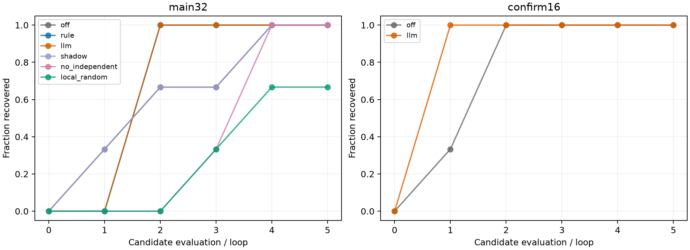
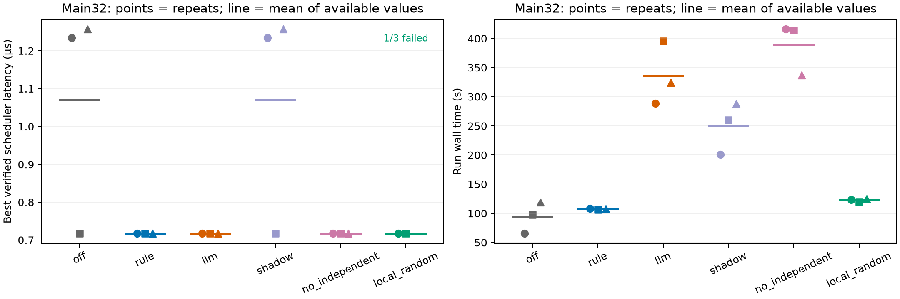
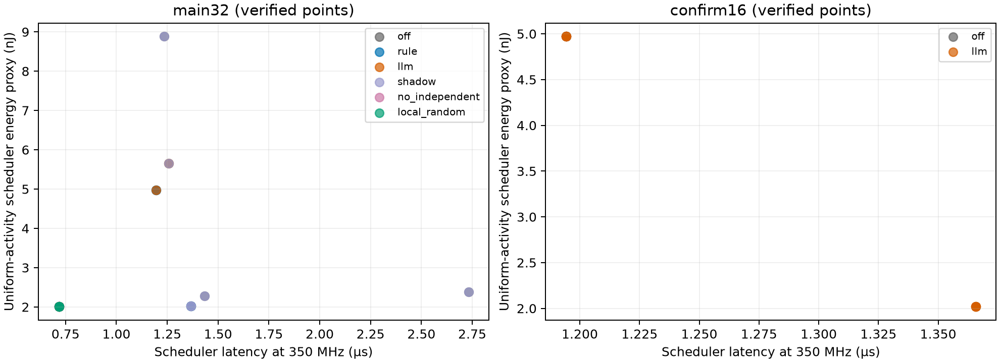

# Critic 消融实验结果：每次最大 loop=5

**结论：Critic 的可执行反馈有工程价值，但本实验没有证明 LLM Critic 优于规则 Critic。** 主实验中，两者都比随机 proposer 找到更好的已验证 scheduler 配置；独立反馈主要使恢复更早。换成 LLM proposer 后，Critic 没有改善最终最优延迟。当前证据支持“可验证的反馈闭环”，尚不足以支持“LLM 替代算法专用人工优化”。

实验于 2026-09-11（纽约时间）执行，准备 job `17427017`，消融 array `17427021`；24 个运行全部完成，每个恰好 5 轮，无中途退出或选择性重跑。预注册配置见 [PROTOCOL.md](PROTOCOL.md) 和 [protocol.json](protocol.json)。

## 1. 实际执行范围与公平性

主实验为 6 组 × 3 次，统一从 32-row 时序失败起点出发，使用随机 proposer。确认实验为 2 组 × 3 次，换成 16-row 起点与 LLM proposer。确认实验同时改变起点和 proposer，因此不能从两组实验之间的差异分别推断这两个因素的效应。

固定算法 `xm:16:8:32:0.75:0.05`；复用已有 32-window 质量确认，relative quality loss **3.529661% ≤ 5%**。本轮没有重新调用 Kernel Agent 搜索 N/M/T，也没有做算法层 Critic 消融。任务为 TinyLlama-1.1B、WikiText-2、sequence length=512、head dimension=64，硬件 trace 为 layer 10/head 0，同一 token SHA。两种 rows 的完整任务分别为 136/272 个调度 tile。

保持 350 MHz、PE≤256、SRAM≤524288 B、L1 area≤4e6 µm²、16-bit 数据和相同合法域。起点新跑功能仿真/Yosys/OpenSTA，32-row 起点 Fmax=324.071 MHz、slack=-0.2286 ns；16-row 起点 Fmax=342.519 MHz、slack=-0.0624 ns，二者均功能正确但不满足时序。

每次最多 5 个候选评估，Critic 动作占原有候选槽，不增加候选预算；成功后继续至第 5 轮。实际昂贵工具次数会因 L1 拒绝而不同，下面完整披露。所有候选的硬件结果均重新测量，仅冻结并复用同任务的输入 trace。seed 控制随机策略；Gemini 2.5 Pro、temperature=0.2 不支持固定 seed，LLM 三次运行是随机重复，不能声称完全可复现。

## 2. 主实验结果

“最优延迟均值”先取每次运行中最小的已验证延迟，再对运行求均值，**不是最后一次探索的结果**。

| 组别 | 5 轮内恢复 | 首次通过轮次（seed 0/1/2） | 最优延迟均值 µs | 最后候选通过 | 平均耗时 s | API 总调用 |
|---|---|---|---|---|---|---|
| 无 Critic | 3/3 | 4/1/2 | 1.069524 | 2/3 | 94.1 | 0 |
| 规则 Critic | 3/3 | 2/2/2 | 0.717143 | 0/3 | 107.3 | 0 |
| LLM Critic | 3/3 | 2/2/2 | 0.717143 | 3/3 | 336.1 | 15 |
| LLM 只分析不执行 | 3/3 | 4/1/2 | 1.069524 | 2/3 | 249.7 | 15 |
| LLM 无独立反馈 | 3/3 | 3/4/4 | 0.717143 | 1/3 | 389.1 | 15 |
| 单字段随机干预 | 2/3 | 4/3/失败 | 0.717143¹ | 2/3 | 122.3 | 0 |

¹ 单字段随机干预的延迟均值只包含 2 次成功，不能与其他组的 3 次成功均值直接等同。

无 Critic 三次最优延迟分别为 **1.234286 / 0.717143 / 1.257143 µs**；规则与 LLM Critic 均为 **0.717143 / 0.717143 / 0.717143 µs**，相对无 Critic 均值低 **32.95%**。但无 Critic 已有 3/3 恢复率，不能说“没有 Critic 就无法修复”。它在 seed 1 甚至第 1 轮就成功；首次成功轮次中位数与 Critic 同为 2，Critic 的优势是更一致地找到低延迟点。

规则与 LLM Critic 都在第 2 轮找到各自最终最优点，后面 3 轮没有改善其已验证最优延迟或 energy proxy 前沿。LLM 平均耗时为规则的 **3.13 倍**，没有产生更好的最终前沿。规则组重复主要检验确定性，3 次相同轨迹不能算 3 种独立故障。

独立反馈的贡献较明确：full feedback 的首次通过为 **2/2/2**，隐藏观测及其派生可行性标记后为 **3/4/4**。前 2 轮通过率由 0/3 变为 3/3，但到第 5 轮，二者的恢复率与最优结果都相同。单字段随机干预为 2/3 恢复，说明局部搜索本身解释了部分收益；n=3 不能据此主张统计显著。

shadow 与 off 的三组配对，全部 15 个候选及验证结果逐一相同，证明只生成分析文本没有改变搜索结果。它增加了 API 与等待成本。





## 3. 确认实验：更换起点与 LLM proposer

| 组别 | 5 轮内恢复 | 首次通过轮次（seed 0/1/2） | 最优延迟均值 µs | 最后候选通过 | 平均耗时 s | API 总调用 |
|---|---|---|---|---|---|---|
| 无 Critic | 3/3 | 1/2/2 | 1.194286 | 1/3 | 351.5 | 15 |
| LLM Critic | 3/3 | 1/1/1 | 1.194286 | 3/3 | 345.9 | 15 |

双方最优延迟均为 **1.194286 µs**。Critic 首次通过为 1/1/1，off 为 1/2/2；Critic 组 13 次进入独立验证均通过时序，off 组 15 次中 7 次通过。这个条件下，Critic 的价值是更少地重新遇到已知失败和更早恢复，而不是更好的最终 latency。

**角色解释必须收窄。** 当前 wrapper 先让 Critic 对 parent 提出变异，batch=1 时变异占满候选槽，delegate proposer 不再调用。本次确认 on 组三次的 proposer API 调用都为 **0**，Critic API 各为 5；off 组 proposer API 各为 5。所以这里实际上比较的是“LLM proposer 提议策略”与“LLM Critic 提议策略”，不能把结果称为在同一个 LLM proposer 上增加 Critic 的纯增量收益。

## 4. 软件配置、硬件方案与 PPA

软件固定为 `N_high=16, N_low=8, M=32, T0=0.75, T1=0.05`，质量损失 3.529661%。主实验最优完整 point（以 `main32_llm_s0` 第 2 轮为例）：

```json
{
  "tile_q": 64,
  "tile_k": 64,
  "tile_d": 64,
  "parallelism": 16,
  "double_buffer": true,
  "num_rows": 32,
  "pe_per_row": 8,
  "reg_width": 32,
  "data_width": 16,
  "sram_bytes": 262144,
  "queue_depth": 0,
  "divider_stages": 12,
  "bank_count": 32
}
```

上面的完整参数保留搜索决策，但本轮独立实现/测量的 scheduler 只由 rows、PE/row、queue、M 决定。其余字段的全栈面积、功耗和性能影响没有在这个 gate 中验证。

| 选择 | rows × PE/row；queue | latency µs | 面积 µm² | 功耗估计 mW | 能量估计 nJ | Fmax MHz | slack ns |
|---|---|---|---|---|---|---|---|
| main_latency_and_energy_proxy | 32 × 8；0 | 0.717143 | 13940.262 | 2.799779 | 2.007842 | 396.929 | 0.3378 |
| confirm_latency | 16 × 8；2 | 1.194286 | 21387.198 | 4.162457 | 4.971163 | 378.681 | 0.2164 |
| confirm_energy_proxy | 16 × 8；0 | 1.365714 | 7374.318 | 1.478434 | 2.019118 | 416.902 | 0.4585 |

所有可用 latency 均按 **350 MHz 固定工作频率**、完整捕获的 scheduler 任务计算。主实验最优为 **251 cycles**，不是旧 T0=1.5 实验中的 222 cycles；不能跨算法混用旧数据。

面积为 Nangate45 标准单元综合面积，未完成布局布线。功耗为 OpenSTA **统一活动率 α=0.0213** 的组件估计，能量为该功耗乘 scheduler latency；不是 workload-annotated power、完整 attention/整机能量或 SRAM 宏实现后的全系统 PPA。原始 validation 的 full-task `energy_j` 仍为 null，不用组件 proxy 冒充它。

确认实验中，16-row queue=2 与 queue=0 分别代表更短延迟和更低能量估计，形成局部取舍；主实验找到的 32-row queue=0 在两项 proxy 上均更好。不要把两个不同搜索条件的前沿合并后声称得到通用全栈 Pareto。完整点及证据路径见 [selected_designs.json](selected_designs.json) 和 [scheduler_proxy_frontier.json](scheduler_proxy_frontier.json)。



预注册的探索性 proxy hypervolume 使用固定参考点 (10 µs, 1 µJ)。主实验 off/shadow 为 0.890805，rule/LLM/blind 为 0.926422，local random 为 0.617615（失败运行计 0）。确认 off=0.877044、Critic=0.878743，差异很小，不解释成真实整机能效收益。

## 5. 成本、失败与完整性

- **120** 次候选评估：8 次 L1 拒绝，**112** 次独立仿真/综合/STA；112 次功能通过，**62** 次满足时序、50 次时序失败。另有 2 次起点验证，不混入候选预算。
- **90** 次 Critic 分析：75 次动作进入候选评估，15 次为 shadow。**75** 次真实 LLM API 调用，无 API 层失败；2 次 Critic 证据路径校验失败，均在 shadow 组，已记录规则回退，不贡献执行收益。
- 两个错误路径分别为 `validation.0.slack_ns`（实际在 metrics 下）和 `history.3.metrics.bank_count`（bank_count 属于 point）。这表明 schema 校验确实阻止了不可追溯证据。
- 主实验各组实际 RTL 次数为 off=13、rule=15、LLM=14、shadow=13、blind=14、local random=15；确认 off=15、Critic=13。等候选预算并不等于等实际工具次数或 wall time。
- 事后补充统一只看各运行**前 3 次独立验证**：off/rule/LLM 都恢复 3/3，最优延迟均值仍为 1.069524 / 0.717143 / 0.717143 µs；因此主实验延迟差异不依赖额外的第 4/5 次 RTL 调用。这个敏感性分析不是预注册主指标，详见 [equal_rtl_budget_posthoc.json](equal_rtl_budget_posthoc.json)。
- 累计运行 wall time（并发任务相加）99.80 分钟，其中 API 调用累计 58.41 分钟。wall time 包含节点、并发与服务延迟差异；实际分区/QOS/节点见 [Slurm 记录](raw/slurm_accounting.txt)，不把它当作严格受控的硬件性能指标。
- **184 个冻结输入源码/文档文件** SHA 未变；设计输入 SHA、完整任务、频率、源码一致性、shadow、盲化和 incumbent 审计全部通过。
- 运行前全套 **424 项测试**通过；加入 cache 身份/篡改与 hypervolume 检查后，最终完整回归 **426 passed in 45.49s**，见 [tests.log](tests.log)。实验策略在冻结后未改写；后续只增加分析、归档与文档。

## 6. 最值得改的地方

1. **先提出候选，再让 Critic 审查。** 保存 raw/executed proposal，避免 Critic 在 batch=1 时直接替代 proposer；分开报告额外 API 成本，同时把真正剩余 loop 预算传给 Critic。
2. **建立参数到 RTL/测量指标的映射。** 主实验 LLM 的 14 次独立验证中，4 次与上一轮验证的是同一 scheduler；盲化组是 7/14。bank/divider/reg 等字段变化不应被说成 scheduler 实测优化；对其他模块派发相应 gate，并按硬件等价类复用已知失败证据。
3. **保留已验证前沿，并区分修复与优化阶段。** 规则组第 5 轮最后候选全部失败，但历史最优均成功。本次已增加 `best_verified_design_id` 并审计正确性；以后应以已验证前沿决定输出，而不是最后一点。
4. **规则优先，复杂问题再调用 LLM。** 已知 queue 时序问题，规则本轮同样有效且更便宜。LLM 应在规则停滞、出现新模块或跨层约束冲突时证明新增价值，不能把规则收益包装成 LLM 能力。
5. **扩大到真正困难的外推任务。** 固定规则/提示词后测试新的 M、sequence length、layer 与分布，并重新测算法精度；做正交的起点×proposer×Critic 网格。当前 3 次重复、单一算法、单层单头以及已有 queue 经验，使“替代人工优化”的证据明显不足。

详细设计见 [IMPROVEMENTS.md](IMPROVEMENTS.md)。这些建议没有混入本轮实验结果。对 hackathon 更可信的表述是：**FAST 完成了可追溯的独立反馈修复；在限定任务与同候选预算下改进了搜索结果，同时用消融识别出规则基线已足够的场景。**

## 7. 如何复查

- [PROCESS.md](PROCESS.md)：全部 24 次运行的逐轮动作、门结果、PPA 与 Critic 分析。
- [runs.csv](runs.csv)、[rounds.csv](rounds.csv)、[reviews.csv](reviews.csv)：运行、120 个候选和 90 条分析的可计算数据。
- [summary.json](summary.json)：聚合结果与审计；[selected_designs.json](selected_designs.json)：完整最终配置。
- `design.json` 是验证前冻结的输入；其中初始 `module_verified=false` 不代表最终失败，最终判定请看 `refinement.json` 与 `rtl/validation.json`。
- `raw/`：原始 API prompt/reply、refinement、validation、工具命令/日志、trace 与 Slurm 记录；`source/` 为冻结源码，`analysis_source/` 为报告脚本。
- `rtl_netlists.tar.gz`：生成 RTL/网表；`artifact_manifest.json`：归档 SHA256。编译对象和可执行文件保留在原始 scratch study，未删除。
- 原始实验：`/scratch/gz2522/gz2522/tmp/micro-hackthon/runs/critic_ablation_20260911`；源码快照：`/scratch/gz2522/gz2522/tmp/micro-hackthon/snapshots/critic_ablation_20260911`。
