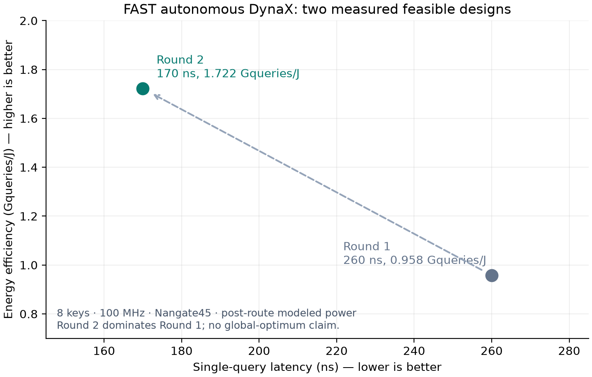

# FAST 自主 DynaX：两轮 E2E、Hammer 与 Critic 实验报告

**FAST 已从只读算法与硬件参考库出发，自主完成小规模 DynaX 行级硬件生成，并通过 Critic 反馈完成一轮有效改进。** 在相同算法配置、100 MHz、质量和面积约束下，延迟从 260 降至 170 ns，建模能效从 0.958 提高到 1.722 Gqueries/J。第二轮在本次两个可行点中同时改善延迟与能效。

[逐轮原始结果](run/summary.json) · [CSV](metrics.csv) · [机器可读指标](metrics.json) · [冻结源码](snapshot/) · [完整归档](artifacts.tar.gz) · [归档校验清单](archive_verification.json)

## 1. 研究问题与实验范围

研究问题是：**Can agentic full-stack co-design replace algorithm-specific manual optimization for dynamic sparse-attention acceleration?**

本次验证一个具体前提：FAST 能否参考已有实现，自主适配算法数学、数据格式、模块接口与流水计划，经独立验证和物理反馈完成优化。它证明了一个有难度的实例闭环；尚未证明在各种算法和规模上替代人工，也没有完成本 DynaX 任务的等预算 Critic ON/OFF 消融。

- 主运行：SLURM `17708305`，执行快照 `dynax_autonomous_v8r1`；结束状态 `critic_stopped`，两轮均 `complete=true, feasible=true`，`reference_integrity=true`。
- 初始输入：只读算法契约、硬件/golden 注册表、任务 prompt 和预算。没有注入旧计划、旧生成 RTL、人工源码补丁或逐次外部诊断。
- 规模：8 keys，Q/K dim=2，V dim=1；Q/K signed 4-bit、V signed 8-bit、输出 16-bit 定点。每块 4 keys，根据质量阈值和稳定排名选择 0/1/2 keys。
- 数学：`dynax_xm_row` 的 `is_quant=False` 精确 LUT 契约，芯片上计算 QK、指数权重、归一化块质量选择、带权归约和最终除法。不是完整模型推理。
- 两轮配置均为 `t0_quarters=6, t1_quarters=2`。Kernel 初轮实测四组合法阈值；其余规模和位宽固定。
- 质量：260 个合成查询，对同一量化输入的 floating dense attention 计算归一化 MAE；损失 0.139733210，上限 0.15；稀疏率 75%。不是 perplexity，也没有独立模型任务精度确认。
- 预算：`max_loops=2`，每轮最多 3 次 Compiler 设计机会，每模块 5 次实现、顶层 5 次组装，`module_workers=1`。这是串行模块执行的证据。

## 2. 软件配置与最终硬件

[实际任务配置](run/task.json) · [算法契约](run/algorithm_contract.json) · [Kernel 测量](run/kernel_survey.json) · [第二轮计划与源码哈希](run/round_02/result.json)

| 模块 | 首轮 | 第二轮最终实现 |
|---|---|---|
| ScoreWeightProcessor | signed QK、max、指数 LUT，3 拍 | 3 拍；显式三级比较树求 max，保留乘加进位 |
| SelectorAggregator | 组合 X:M 选择、mask、归约 | 组合选择/归约；重新生成阈值比较与扩位表达式 |
| FinalDivider | 只读原生除法器适配，18 级 | `predict_unit.FixedPointDivPipelined`，bitWidth=31、point=0、**9 级** |
| DynaX_XM_Row_Top | 连接模块、锁存中间值，26 拍 | 更新控制与时序对齐，**17 拍** |

最终生成 Chisel：

- [ScoreWeightProcessor](run/round_02/build_02/ScoreWeightProcessor/ScoreWeightProcessor.scala)
- [SelectorAggregator](run/round_02/build_02/SelectorAggregator/SelectorAggregator.scala)
- [FinalDivider](run/round_02/build_02/FinalDivider/FinalDivider.scala)
- [DynaX_XM_Row_Top](run/round_02/build_02/DynaX_XM_Row_Top/DynaX_XM_Row_Top.scala)

原库除法器及支持源码不改动，以 `linked_reference_ids` 加载并校验完整依赖闭包。Compiler 定义的局部行为测试使用 `test_generation_version=2`，包含打包有符号极值；最终 E2E golden 由独立算法插件产生。

## 3. 完整物理结果

| 指标 | 首轮 | Critic 后第二轮 | 变化 |
|---|---:|---:|---:|
| 周期/query | 26 | 17 | −34.6% |
| 延迟 ns | 260 | **170** | −34.6% |
| 标准单元面积 µm² | 37,813.496 | **34,272.770** | −9.36% |
| 布线后建模功耗 mW | 4.01534094 | **3.41660227** | −14.91% |
| 能量 nJ/query | 1.0439886444 | **0.5808223859** | −44.37% |
| 能效 Gqueries/J | 0.957864825 | **1.721696726** | **+79.74%** |
| Dense-equivalent TOPS/W | 0.045977512 | 0.082641443 | +79.74% |
| Setup slack ns | 5.80800819 | 5.98842907 | 均满足 |
| Hold slack ns | 0.00817429 | 0.00933106 | 均满足 |
| Route DRC | 0 | 0 | 通过 |
| 质量损失 / 上限 | 0.139733210 / 0.15 | 同首轮 | 满足 |

固定频率 100 MHz；面积约束 200,000 µm²，按标准单元面积检查。Die / core 面积两轮固定为 435,600 / 395,923.71 µm²；表中面积下降不代表 die 缩小。

物理后端是 Hammer + Yosys + OpenROAD，包含 placement、CTS、详细布线与 OpenRCX 寄生提取。Nangate45 TT，1.1 V，25°C；输入输出延迟 1 ns、输出负载 5 fF；统一 activity=0.1。功耗是布线后建模结果，不是硅片测量；未生成 GDS，未做多 PVT signoff。

能量定义为建模平均功率 × 单次查询延迟，能效为其倒数。Dense-equivalent 计数固定 48 ops/query；不把它解释为稀疏硬件的实际运算数或持续流吞吐效率。

图中左上更好，第二轮支配第一轮。`pareto_rounds=[2]` 表示本次测得点集的非支配结果，不代表全设计空间最优。两点图不能证明搜索已收敛。

## 4. 验证证据

| 检查 | 第一轮 | 第二轮 |
|---|---|---|
| 主流程独立算法 E2E | 100/100，26 拍 | 100/100，17 拍 |
| 源码重新构建及额外种子 | [600 次通过](holdout_round_01/summary.json) | [600 次通过](holdout_round_02/summary.json) |
| 实际布线后网表 | [100/100](gate_round_01/summary.json) | [100/100](gate_round_02/summary.json) |
| 参考库完整性 | 通过 | 通过 |

每轮 600 次包括原种子 100 次和种子 101/211/307/401/503 各 100 次；边界向量可能重复。E2E 同时比较最终数值与选择掩码，并覆盖有符号极值、零、ties、连续事务和复位。

门级是零延时功能仿真；时序结论来自独立 STA。Holdout 重建采用 `yosys_opensta` 后端，验证摘要的 `passed` 表示重建/功能和测量流程完成，**不等于该后端的 `evaluation.feasible`**；主结果表只使用两轮原始 Hammer 测量，不用复验的预布局数替换。

## 5. Critic 实际做了什么

1. [第一次 Critic](run/agent_calls/critic/0001.json) 读取实际 26 拍、5.81 ns slack、面积和能效，建议将除法器 18→9 级，返回 `layer=uarch`。
2. UArch 识别这会违反冻结的 18 拍接口契约，提出 replan。`CompilerDiagnosis` 复核后接受，要求 Compiler 修订 FinalDivider 的 9 拍行为和顶层对齐；见 [事件记录](run/events.json) 的 `compiler_replan_review`。
3. Compiler 重新规划；模块实现与组装重新验证。SelectorAggregator 曾出现 `.asUInt(25.W)` 编译错误，局部诊断提出 `.pad(25)` 修复，随后通过。
4. 第二轮独立 E2E 和 Hammer PPA 得到 17 拍及更低能量，第二次 Critic 返回 stop。两轮预算用尽，没有第三轮。

这说明优化反馈、跨层契约冲突处理、重新实现、独立验收与再测量已闭合。第一次建议选错重入层并未被直接放行，而是经 Compiler 重规划处理。

同时也有局限：重规划导致 Score/Selector 等模块一并改写，Score 的 max 从 reduce 表达式改为显式比较树。因此改善是整个第二轮候选的结果，不能把功耗、面积和时序收益全部单独归因于除法器参数。UArch 自述首轮 max 存在潜在时序缺陷也不是测量结论：首轮实际 STA 已通过。

## 6. 运行成本与可复用资产

共 27 次记录调用：Kernel 1、Compiler 7、模块 UArch 13、组装 UArch 2、CompilerDiagnosis 2、Critic 2。Compiler 的检索/计划回复也计入调用数，不能当作 7 个独立硬件候选。

首轮从开始到 E2E 18.43 分钟、到 PPA 32.54 分钟；主流程至第二次 Critic 的事件跨度约 71.26 分钟。额外复验和前序失败开发尝试不含在此时间内；没有据此估计人工节省比例。

可复用资产包括：只读 IP 链接机制、算法行为契约、局部测试与独立 E2E 分离、Compiler 诊断/重规划、物理反馈、原始角色记录，以及可搬迁的哈希归档。前序失败与成本另见 [开发归档](../../history/README.md)。

[恢复运行](../dynax_fast_recovery_20260913/RESULTS.md) 单独保留，首轮由外部选取旧模块，软件阈值也不同，不能视为本次无 Critic 对照。

## 7. 保存与复现

`artifacts.tar.gz` 包含 1,006 个文件：原运行全部非缓存记录、成功与失败源码、原始角色请求/回复、最终 RTL、routed.v/DEF/ODB/SPEF、DRC 和时序功耗日志、冻结执行源码，以及两轮独立复验。归档 SHA-256：

`1638131c268edb257a284156097fde7885eae3eca2a24cc2758c7035ea2e42bb`

`run/` 与 `snapshot/` 是普通文件的阅读副本，不依赖 scratch 软链接；阅读副本省略大物理产物和部分工具日志，完整复验请解压归档。清单显式记录了排除的编译缓存和中间 OpenROAD checkpoint，保留最终物理数据库。

[复现步骤](../../dynax-autonomous.md) · [整理与验证记录](../../cleanup-2026-09-13.md)。归档内原始 JSON/日志保留当时的绝对路径。搬迁后使用当前复验入口读取归档自身的源码和原生 IP 快照；这是复验兼容性修复，不反向归算成原运行的新行为。

## 8. 下一步改进建议

1. **先做受控消融。** 固定算法、起始设计、约束、模型和工具版本，比较 ON/OFF/规则 Critic，匹配 LLM 与硬件工具预算，多个 seed。当前两轮只能证明一次改进。
2. **缩小重建范围。** 为 Critic 输出显式变更模块和接口影响，Compiler 更新依赖闭包；原模块可按哈希复用，但变更候选必须复验。减少本次重规划引入的无关重写。
3. **稳定规划契约。** 检查延迟变化与 reentry 层是否匹配；保留诊断升级，同时减少先进入 UArch 再被动 replan 的成本。
4. **逐层扩规模。** 先增加 key 数和 head dimension，补充饱和/舍入/溢出约束，再加入 SRAM、反压与批量查询；每次沿用独立 golden。
5. **提高功耗可信度。** 引入真实工作负载活动标注，区分单请求 latency、持续吞吐和 J/query，评估活动率/工艺角敏感性，再讨论更完整的 Pareto 前沿。
