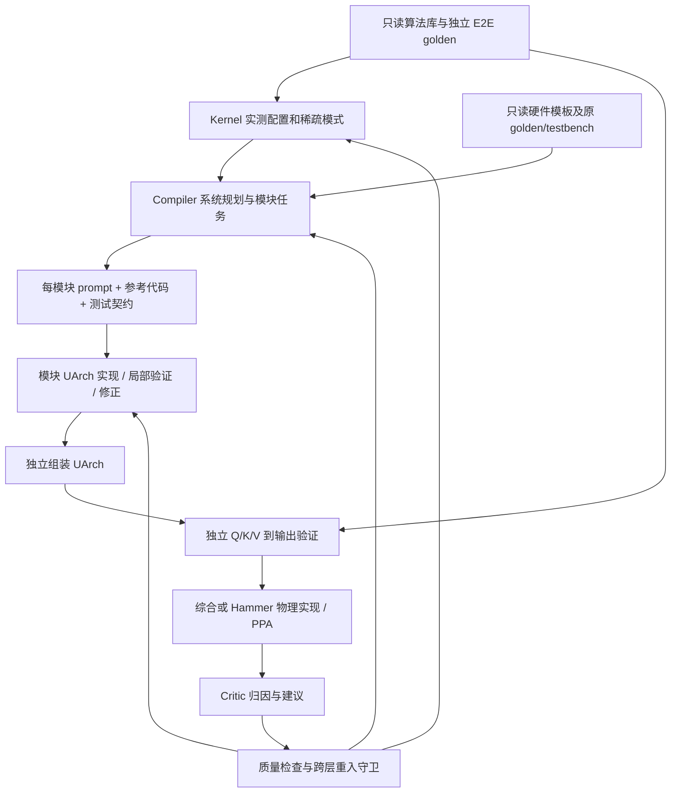

# 20 分钟读懂本次修改

先读 [结果与限制](RESULTS.md)，再按下面顺序读代码。以 `fast/fullstack` 为当前主线；旧 `fast/orchestrator` 的历史能力不自动算进新实验。

1. **任务与库（3 分钟）**：`configs/fullstack/threshold_attention.json`、`configs/fullstack/dynax_xm_row.json`、`libraries/catalog.json`、`fast/fullstack/library.py`。看算法端口/配置域如何定义，硬件源码和原 golden/testbench 如何一起检索、按 hash 冻结。
2. **Compiler 产物（4 分钟）**：`fast/fullstack/contracts.py` 的 SystemPlan、Module，以及 `behavior.py`。理解模块依赖、端口、局部行为契约、测试向量和 design_prompt。Compiler 规划及分配测试，UArch 负责实现。
3. **实际调度（5 分钟）**：`flow.py::compile_plan`、`dispatch.py`。已读模板和待确认计划跨检索 turn 保留；模块按依赖执行并局部重试；默认 workers=1；通过的子模块交给独立组装 UArch，最后独立 E2E。
4. **评价与迭代（4 分钟）**：`tools.py::evaluate`、`physical.py::evaluate_hammer`、`flow.py` 的 Critic 分支。注意 complete 与 feasible 不同，质量守卫和 Kernel 最终配置如何阻止过期建议进入下游。
5. **读一次真实设计（4 分钟）**：[R2 完整计划](runs/critic_on_17693050/round_02/result.json)、对应 `sources` 的 Chisel、[物理报告](runs/physical_on_r2_17695367/revalidation.json)、[门级检查](runs/gate_on_17695528/summary.json)。对照源码中的三级除法器与报告的 9-cycle 系统延迟。

图表示当前框架支持的流程。本轮 Critic 对照在线读取预布局 PPA，之后才用 Hammer 重测；不要把框架支持的物理后端写成本次 Critic 已经在线使用的反馈。

PPT 6 页建议：研究问题与约束 → 只读库和生成/验证分工 → 基线除法瓶颈 → 三级除法器和 9-cycle 新系统 → 布线后 Latency–Energy Efficiency 对照 → DynaX 迁移状态、失败案例和下一步可检验假设。
